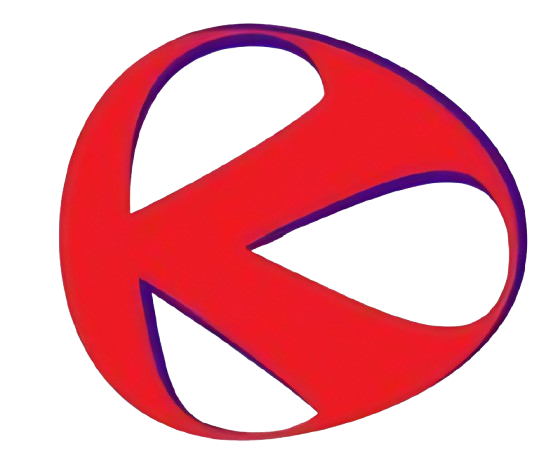

<p align="center">
	
</p>

<h1 align="center">Kaizen Events & Promotions</h1>

Kaizen is a research-driven marketing agency specializing in transforming customer insights into impactful campaigns that drive awareness, trial, and loyalty across both traditional and digital channels.

---

## Features

- **Modern Responsive Design** – Mobile-first, accessible, and visually engaging UI/UX
- **Dynamic Blog** – Powered by Sanity CMS for seamless content management
- **Contact Forms** – Secure, validated forms for client inquiries
- **Performance Optimized** – Built with Vite for fast development and production builds
- **SEO Ready** – Semantic HTML, meta tags, and structured data for discoverability

## Tech Stack

- **Frontend:** React 18, Vite
- **Styling:** CSS Modules, Custom CSS, Tailwind (optional)
- **CMS:** Sanity.io
- **Deployment:** Vercel
- **Icons:** React Icons, FontAwesome
- **Forms:** Email validation via AbstractAPI

---

## 📦 Getting Started

### Prerequisites

- Node.js (v16 or higher)
- npm or yarn

### Installation

1. **Clone the repository**
	 ```bash
	 git clone https://github.com/iamRahul21/kaizen.git
	 cd kaizen
	 ```

2. **Install dependencies**
	 ```bash
	 npm install
    ```

3. **Start the development server**
	```bash
	npm run dev
	```

4. **Build for production**
	```bash
	npm run build
	```

---

## 📁 Project Structure

```
src/
├── components/   # Reusable UI components
├── pages/        # Main page components
├── styles/       # CSS files
├── lib/          # Utilities and configurations
└── assets/       # Static assets
public/           # Images, logos, and static files
sanity-studio/    # Sanity CMS configuration
```

Designed and developed by <a href="https://rahul-deka.vercel.app" target="_blank">Rahul Deka</a>